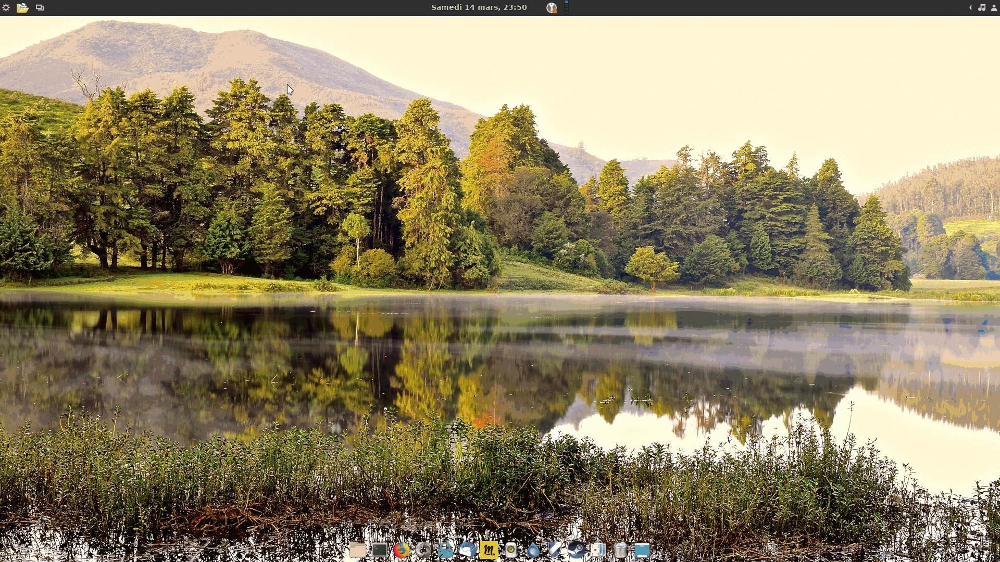

# Start_in_another_workspace
[](https://github.com/pzim-devdata/Tools-for-Debian/blob/master/LICENSE)    [](https://github.com/pzim-devdata/Tools-for-Debian/issues)                [](https://GitHub.com/pzim-devata/Tools-for-Debian/commit/)


[Download :inbox_tray:](https://github.com/pzim-devdata/Tools-for-Linux/releases/download/v1.0.0/Start_in_another_workspace.zip)

## Description :

Here is a script for starting a program in another workspace for Linux. Works with wmctrl. 

You can use this script with Nemo or Nautilus in order to laugh any application quickly and easily :blush:. Install them in this directory :

- For Caja (Mate) in : ~/.config/caja/scripts.
- For Nautilus (Gnome/Unity) in : ~/.local/share/nautilus/scripts
- For Némo (Cinnamon) in : ~/.local/share/nemo/scripts/



## How to install :

1. Install wmctrl
```command
sudo apt install wmctrl
```

2. And create a script (in this example thunderbird on the second workspace (```-t 1```)):

```bash
#!/bin/sh

 (thunderbird &)  & sleep 5 && 
sh -c "wmctrl -i -r `wmctrl -l | grep Thunderbird` -t 1"
```

To know your application name on wmctrl you can view it by taping on your terminal :
```command
wmctrl -l
```
And replace it with the correct name in the script.

Be carrefull with the capital letter ("Thunderbird" not "thunderbird") !!

Other example with firefox on the 3d workspace (```-t 2```):

```bash
#!/bin/sh
(firefox &)  & sleep 5 && 
sh -c "wmctrl -i -r `wmctrl -l | grep Firefox` -t 2"
```
3. Bonus :
Here is the command to execute at start-up :
```bash
sh -c "thunderbird  & sleep 5 && wmctrl -i -r `wmctrl -l | grep Thunderbird` -t 1"
```

Works on Debain 10 with Cinnamon. But should works for all.


--------------------------------------------

## - [Licence](https://github.com/pzim-devdata/DATA-developer/raw/master/LICENSE)
MIT License
Copyright (c) 2019 pzim-devdata

--------------------------------------------

## - [Contact :email:](mailto:pizim@posteo.net?subject=Contact%20from%20Github)
Created by [@pzim](https://www.pzim.fr/) - feel free to contact me!


